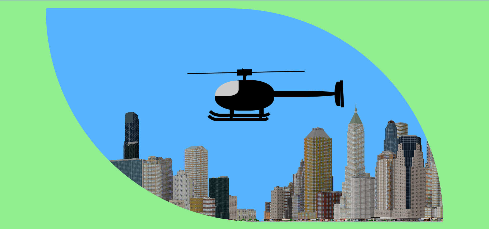

# helicopter

## Description
In this project a helicopter is created using only HTML and CSS. Keyframes are used to create movement in the helicopter rotor and tail fin. to create the illusion of movement an image is repeated across the x axis and this is moved using a keyframe animation
## Demo
A demo for the live site can be found here https://tod619.github.io/helicopter/
